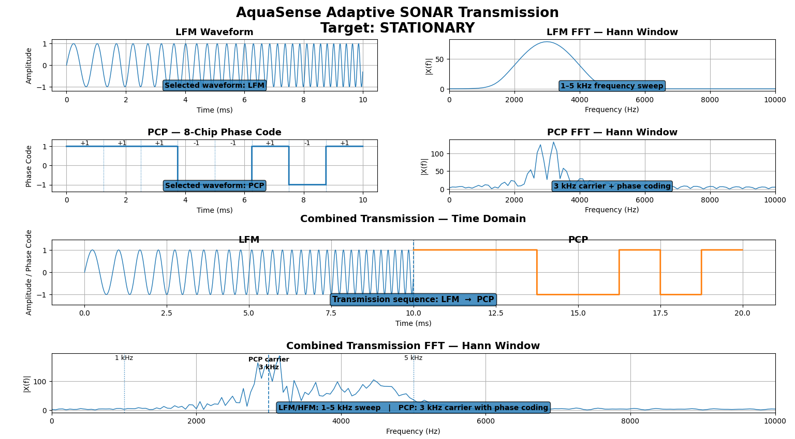
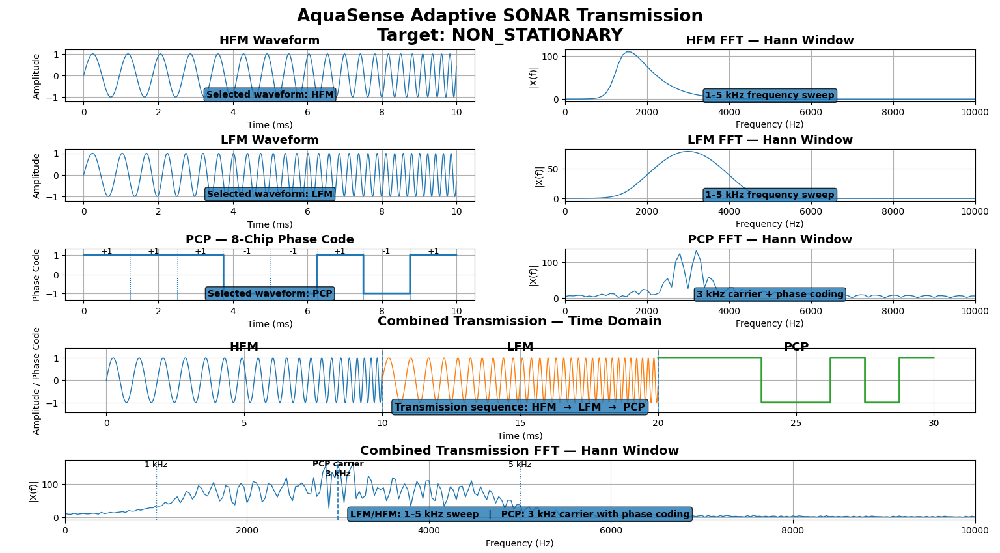

# AquaSense Results

This folder contains the **final competition demonstration outputs** for the AquaSense adaptive SONAR transmission prototype.

## Final Demonstration Outputs

### 1. Stationary Target — LFM → PCP

The stationary-target demonstration uses the sequence:

`LFM → PCP`

The figure shows the generated LFM waveform, Hann-windowed FFT, PCP phase-code waveform, PCP FFT, and the combined transmission time-domain and frequency-domain views.

### 2. Non-Stationary Target — HFM → LFM → PCP

The non-stationary-target demonstration uses the sequence:

`HFM → LFM → PCP`

The figure shows the generated HFM and LFM waveforms, Hann-windowed FFT results, PCP phase-code waveform, PCP FFT, and the combined transmission views.

### 3. Final Screen-Recorded Demonstration

The final screen recording demonstrates the AquaSense software workflow, including the ESP32 serial interface, target selection, adaptive waveform sequence, and Python visualization.

**Video:** `AquaSense_Final_Demo.mp4`

## Prototype Configuration

- **Controller:** ESP32
- **Sampling rate:** 1 MHz
- **Samples per waveform:** 1000
- **Waveform duration:** 1 ms
- **Frequency band:** 250–270 kHz
- **PCP carrier:** 260 kHz
- **PCP code:** `+ + + - - + - +`
- **Serial communication:** 115200 baud
- **Signal processing:** Hann window → FFT
- **Display range:** 0–500 kHz

## Demonstration Sequences

| Target state | Transmission sequence |
|---|---|
| Stationary | `LFM → PCP` |
| Non-stationary | `HFM → LFM → PCP` |

The target state in this prototype is **software-commanded/simulated** because a physical SONAR receiver is not connected. In a complete SONAR system, target motion would be inferred from received echo behaviour.

## Important Note on the FFT Display

The Python dashboard includes a controlled presentation spectrum so that the competition demonstration clearly shows the intended frequency-domain behaviour. It is **not a measured underwater acoustic spectrum** and should not be presented as a physical measurement.

## Evidence Classification

The files in this folder are **prototype demonstration evidence**. They document the current ESP32 + Python implementation and its software-generated waveform/FFT visualizations.

They should not be interpreted as:

- measured underwater acoustic data,
- receiver-based target detection results,
- transducer performance measurements, or
- quantitative power measurements.

## Future Physical Validation

Future experimental results may include DAC output captures, filtered/amplified waveform measurements, transducer/receiver measurements, oscilloscope captures, measured FFT/spectrograms, processing-time measurements, and power measurements.
